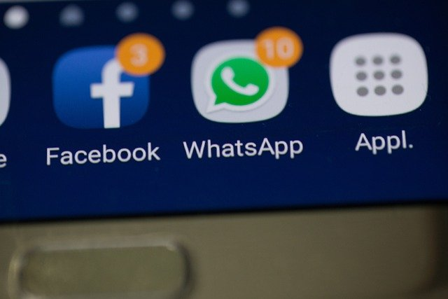

### Let's change the definition of Android Launchers...for the greater good!

Homescreen Launchers are often those bloated GUI pages where you have to painfully search your application icon and after finally finding it, click on it and wait till eternity till your Launcher starts to open it!😪😴😰

Also, there is an even bigger issue, which most of us don't realize: Distraction

Credits: [nirandfar.com](https://www.nirandfar.com/hack-back-phone-distractions/)

With so many apps making a visual impression on your mind about their presence, every time you unlock your phone or close an app, you involuntarily get an urge to open them. I mean, when was the last time you opened Instagram out of need. Won't be easy to recall I bet! Instagram thrives because of 2 major strategies which it uses to repeatedly onboard users. The first one is well-known:

Notifications. It's algorithm selectively pushes notifications on your drawer that are most probably bound to pique your interest and you find yourself clicking it. The solution to this problem is simple as you would have guessed it. No need to repeat that.

* [ ] What concerns me is the second lesser-known strategy that not only benefits Instagram, but all apps that monetize your attention. And that my dear friends is (lo and behold)..................your phone's in-built Launcher. We often find ourselves checking out our phone when there's nothing to do. Whether you're sitting alone, waiting for your bus, waiting for the next professor to come for the lecture, walking to the canteen, starting some work, going to bed...or just bored, you casually put your hand in the pocket and bring that Yantra (Hindi word for device) out. You unlock it and glance at the apps. You find one cute shiny icon asking you to tap on it. You pity on that icon and fulfill its request. And boom...15-20 minutes of your life wasted. You could have used that time to reflect upon yourself. That is boring but boredom is actually good for us. Social neuroscientists have found that the brain has a default network mode that is on when we're disengaged from doing. Boredom can actually foster creative ideas, refilling your dwindling reservoir, replenishing your work mojo and providing an incubation period for embryonic work ideas to hatch.

Do you know that Smartphone manufactures also have a secondary business model: Pre-installed apps. A [study](https://ieeexplore.ieee.org/abstract/document/9152633) found that pre-installed apps in Android phones are used for data collection, tracking, and monitoring, without the user's knowledge. Apart from this, it also increases the app's popularity as more people have to compulsarily see it on their launchers. Manufacturer's obviouly get paid huge amounts of money for this. The problem that is related in this context is that the user is eventually going to open that app once to see what it is and then the algorithms are always there to make him a repeating user.

> We’re training and conditioning a whole new generation of people that when we are uncomfortable or lonely or uncertain or afraid we have a digital pacifier for ourselves that is kind of atrophying our own ability to deal with that.
> — Tristan Harris, former design ethicist at Google

Quick-note: Social media is probably the best invention in consumer software and I am no way rallying against it. I just think that people should be more aware of where they spend their time. No Hard-feelings :)

#### Ok so have you got any solution?

I have attempted I'd say...

As we saw that the root problem here is the Launcher. That is what baits us. Besides that is what we can control! I mean, who is gonna ask apps to stop being so addictive and manufacturers to stop pre-installing them.

So as simple as it is, lets change the Launcher.🥳

Now there are many launchers out there. I have tried a few of them. But I found that they are all bloated and/or slow. I wanted something that is fast, minimal and customizable. Also, there is no point of a GUI launcher i.e a Launcher that has apps displayed as icons. Wait...What? Is there a launcher without icons?

Turns out there are a few...Yes! There's a whole class of Launchers known as CLI(Command-Line Interface) Launchers. They work in the command-line. There is no fancy UI to mess with and what you get is a very powerful tool. You enter commands to do everything like opening apps. Now before you close this article thinking that it's not for you...wait a sec. Though it can be intimidating and tough to use at first, it has a pool of advantages to offer you:

- No distraction
- No bloated GUI
- Fast
- Customizable
- Minimal
- Powerful
- Cool

#### But how does it solve the problem?

When you unlock your phone, you now see a command-line terminal which waits for you to order it what you want to do, rather than distracting you by presenting a collection of all apps as icons. You wanna see the news. Just type `news` and hit Enter. You wanna listen music, just type `launch Spotify` or just `l Spotify` and hit Enter. This way you get to select how you want to use your time. Studies show that the quality of a decision made by a human is inversely proportional to the choices offered to her. So when you are not bombarded with so many choices of apps whenever you unlock your Yantra, you are more likely to make a good use of your time.

There are a ton of other features available like a simple todo utility so you can focus on your tasks, setting custom themes and wallpapers, weather reports, simplified google searches and App Lock to name a few. You can even automate tasks that you perform every time you open your phone.

#### What's it called?

I named it as Yantra Launcher. As I mentioned, Yantra means Device so it's just a plain and simple Launcher for your device, in its purest purpose.

#### How to use it?

Yantra Launcher is available for download on [Play Store](https://play.google.com/store/apps/details?id=com.coderGtm.yantra). Once its downloaded, open it and that's the CLI you get. Type `help` and hit Enter to get a list of all commands. Believe me, it's much easier to use than what you anticipate.

#### Why only Yanta Launcher?

As I said, there are a few other CLI Launchers availble in store but they all fall in atleast one of the following categories:

1. They are too advanced for a normal user. You need to be quite good in programming to use them conveniently
2. They lack basic functionalities
3. They are to focussed on being cool that they forgot their original purpose: Lesser Distraction, more Power and Speed. Basically, they bloat your screen with fake hacking images.

Yanta Launcher aims to be a sweet spot between them where you will eventually learn to use its powers and hopefully embrace them. Whether you're not a programmer or you're well-versed in it, Yantra launcher has a lot to offer you

#### Conclusion

Yantra Launcher is a simple, minimal and powerful CLI Launcher. It's not for everyone but it's for those who want to get the most out of their time.

So that's it. I hope you liked this article. If you did, please share it with your friends and family. Also, if you have any suggestions or feedback, please let me know via [email](mailto:gautammehta0000@gmail.com) or in the [reviews](https://play.google.com/store/apps/details?id=com.coderGtm.yantra) section of Play Store. I would love to hear from you. That helps me in improving the User Experience for everyone.

Thank you for reading. Have a nice day!

Yours Truly,

coderGtm
